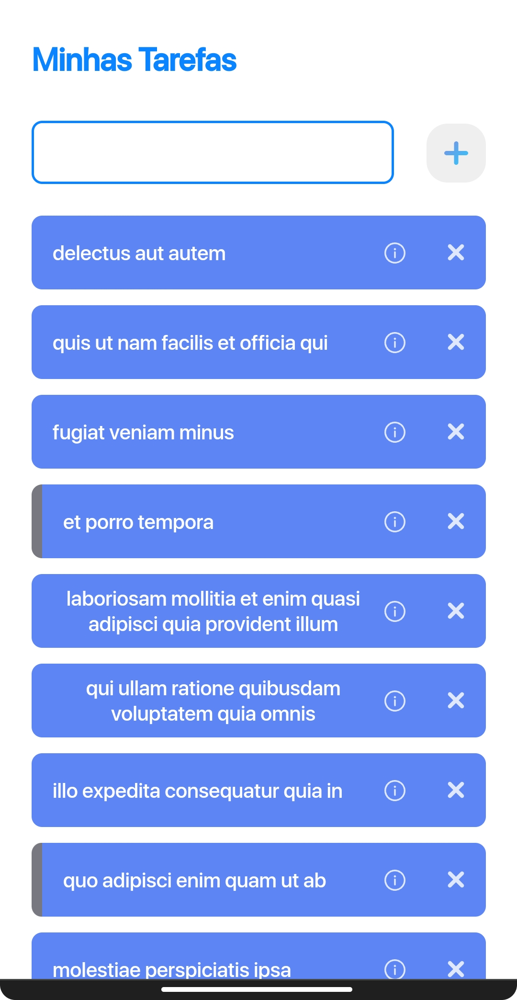
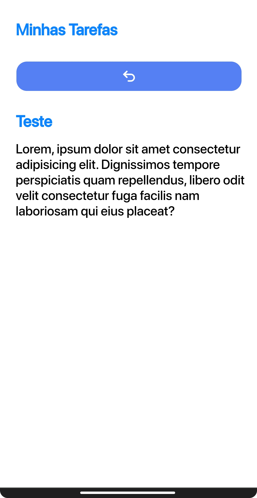

# Notes
Notes é o primeiro aplicativo que faço usando a tecnologia React.
O React é uma tecnologia que vem em crescente no mercado dos desenvolvedores FrontEnd, ele é um framework js que facilita a construção de páginas e sua característica principal é a criação de componentes.
Para saber mais do <a href="public/Anotações.md">React</a>, clique no link.

<p align="center">

<p>
  
## Mobile First
Diferente das aplicações do meu <a href="https://github.com/UlissesJunior">Github</a>, dessa vez trouxe uma aplicação com o método mobile first, que significa basicamente "focar" em uma aplicação no modo mobile.
<p align="left">

<p>
<p align="right">

<p>
  
## Consumo de Bibliotecas/API
Neste projeto usei 3 bibliotecas/API, ambas com diferentes funções.

### React Router Dom
O react não tem páginas como no Html, sendo assim, tudo ocorre por uma dinamização usando a biblioteca <a href="https://www.npmjs.com/package/react-router-dom">React Rouder Dom</a>.
### Instalação

Para a instalação, utilizamos o seguinte comando:

```jsx
npm install react-router-dom@5.2.0
```

### uuid
O <a href="https://www.npmjs.com/package/uuid">uuid</a> é uma biblioteca que gera ids aleatórios.
### Instalação

Para a instalação, utilizamos o seguinte comando:

```jsx
npm install uuid
```

### Axios
A <a href="https://www.npmjs.com/package/axios">Axios</a> é uma API de notas, que gera notas automaticamente quando requisitada (um tipo de Lorem Ipsum).

### Instalação

Para a instalação, utilizamos o seguinte comando:

```jsx
npm install axios
```
